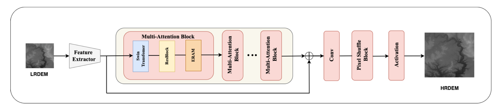

## MASTERGAN: Multiple Attention Swin Transformer Enhanced Residual GAN

Implementation of the Multiple Attention Swin Transformer Enhanced Residual GAN in PyTorch on [DemDataset](https://www.kaggle.com/datasets/mohammadkashif20/demdataset8020). This repository hosts the training and validation code for super-resolution of Depth Elevation Maps using MASTER GAN.

### Model Details

The introduced novel model uses multiple attention modules together, along with Residual skip connections and a simple CNN based feature extractor to create high resolution depth elevation map from a given low resolution depth elevation map. The model architecture is shown in:

### Figure 1: Architecture of MASTERGAN 

## Results
The introduced model achieves state-of-the-art results across all metrics on the test set of DemDataset.
The table below shows the performance of various models discussed, along with existing state-of-the-art results on the dataset.

| Model    | PSNR   | SSIM   |
|----------|--------|--------|
| Swin IR  | 30.753 | 0.907  |
| SRResNet | 26.876 | 0.845  |
| D-SRGAN  | 30.828 | 0.9172 |
| ESPCN    | 29.078 | 0.877  |
| SRCNN    | 30.630 | 0.907  |
| MATSRGAN | 31.024 | 0.908  |

## Author Details
- Author 1:
  - Name: Azhan Mohammed 
  - LinkedIn: https://www.linkedin.com/in/azhanmohammed/
  - Personal Website: https://www.azhanmohammed.xyz

- Author 2:
  - Name: 
  - LinkedIn: 
  - Personal Website: